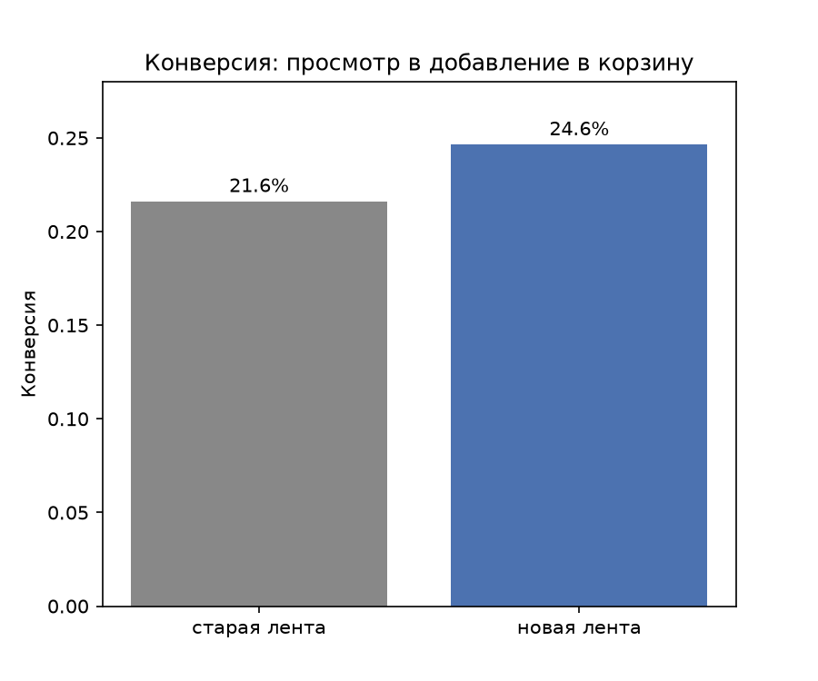

# A/B-тест: упрощение формы оформления заказа

## Гипотеза
Если мы добавим под названием товара список ключевых характеристик в ленте поиска (например, роутер с поддержкой 5GHz, смартфон с поддержкой NFC), то конверсия из просмотра в добавление в корзину вырастет, потому что часть пользователей, не видя ключевое слово или характеристику в ленте, просто пролистывает товар.

## Дизайн эксперимента
- Основная метрика: конверсия просмотр → добавил в корзину
- Guardrail: средняя цена товара, добавленного в корзину (ACV)
- Размер выборки: рассчитан через power analysis (alpha=0.05, power=0.8, MDE=3 п.п.) — 3133 на группу
- Проверка SRM: пройдена (p=0.9081) (хотя реальные данные, использованные для теста метрик, были меньше, так как брались количеством в соответствии с MDE, для чистоты эксперимента, а размер групп в сгенерированной выборке больше)

## Результат
Конверсия в новой ленте выросла с 21.6% в старой ленте до 24.6% (разница +3 п.п., 95% ДИ [0.0094, 0.0512], p = 0.0044 < 0.05).
Guardrail метрика: ACV значимо не изменилось (p = 0.3426 > 0.05)

## Рекомендация
Применить новую ленту ко всем пользователям.

## Инструменты
python (numpy, pandas, scipy, statsmodels), jupyter
